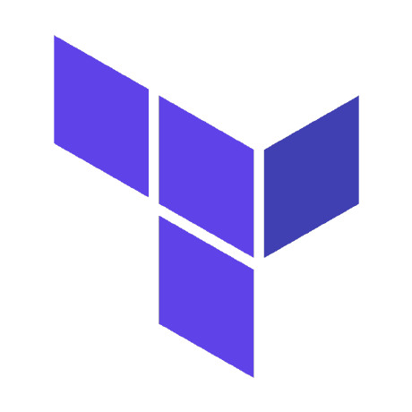

# Patricks Homelab

After years of relying on hardware at work or cloud infrastructure, I started to setup a lab at home again.

After being more than two decades in IT, while primarly working on the full stack (server, storage, networking, virtualization), the stacks starts to shift again. While using virtualization with VMware and Hyper-V for over 15y, Container, Cloud and IaC seems to be the next big stack evolution. This lab is mainly used to get my hands dirty with

- Linux
- Docker/ Podman
- Proxmox, and
- Infrastructure-as-Code with Ansible, Terraform and Packer

## Overview

Project status: **ALPHA**

This project is still in a very early stage.

### Use case

- [x] Common applications: Paperless NGX (to be continued)
- [x] Support multiple environments (dev, prod)
- [x] Infrastructure as Code (Terraform, Ansible)
- [x] Container Infrastrucutre (Docker, Kubernetes)

### Hardware

Instead of using four HPE ProLiant DL360 G7 and a Synology NAS as in my first lab, I decided to use something smaller, quiter and less power hungry. The hardware of choise was a chinese barebone [HUNSN RJ42](https://amzn.eu/d/3kxxmGl).

- Intel N100 (4C/4T Alder Lake-N 12th Gen)
- DDR5-4800 MHz
- 2x M.2 NVMe 2280 Slot
- 1x TF-Card Slot
- 2x SATA 6 Gbit/s
- 4x Intel 2.5GbE I226-V
- 2x HDMI 2.1
- 1x Display Port 1.4
- 4x USB-A 2.0, 2x USB-A 3.0
- 1x USB-C for data and display

I ordered the system without SSD and memory and added these components:

- Corsair VENGEANCE 32GB DDR5 SODIMM [Link](https://amzn.eu/d/2hHZxY5)
- WD Black SN770 NVMe with 1 TB [Link](https://amzn.eu/d/bLbd7x9)
- WD Green SN350 NVMe with 2 TB [Link](https://amzn.eu/d/bLbd7x9)
  
The whole system is fanless and consumes about 10W per hour, which makes ~30 € per year (based on the current power costs in Germany). As you can see on the pictures, the system offers a lot of connectivity. You might also notice the two SATA ports on the mainboard. There is no way to get a 2,5" disk into the case, but you can route the cables through a opening on the bottom of the case.

### Home network

This is a picture of my network rack. You may get an impression of how small the computer is. On the left is my NAS, a Synology DS414slim with four 480 GB SSDs. I use it for file shares and with NFS as a backup target.

A small note: Yes, this is fibre optic on the patch panel. During the building of our house, I managed it to get some single mode fibre cables into each bed room and my home office. :)

There is an AVM Fritz!Repeater 2400 on the first floor and on the second floor, which work together with the AVM Fritz!Box 5590 in the network rack. Deutsche Telekom was kind enough to install fiber optics (100 Mbit down/ 40 Mbit up) in the house.

The Proxmox server and the Synology DS414slim are both connected with 1 GbE to the HP 1920 switch.

### Tech Stack

As a VMware guy the installation of VMware ESXi would be a no-brainer, but unfortunately Broadcom decided to cancel the VMware free hypervisor. This lead to the nice chance to try another hypervisor, in my case, [Proxmox Virtual Environment](https://www.proxmox.com/).

The following software is also used:

<table>
    <tr>
        <th>Logo</th>
        <th>Name</th>
        <th>Description</th>
    </tr>
    <tr>
        <td></td>
        <td><a href="https://www.ansible.com">Ansible</a></td>
        <td>Configuration management</td>
    </tr>
    <tr>
        <td></td>
        <td><a href="https://www.terraform.io">Terraform</a></td>
        <td>Infrastructure deployment</td>
    </tr>
    <tr>
        <td></td>
        <td><a href="https://www.proxmox.com">Proxmox VE</a></td>
        <td>Bare Metal Hypervisor</td>
    </tr>
</table>